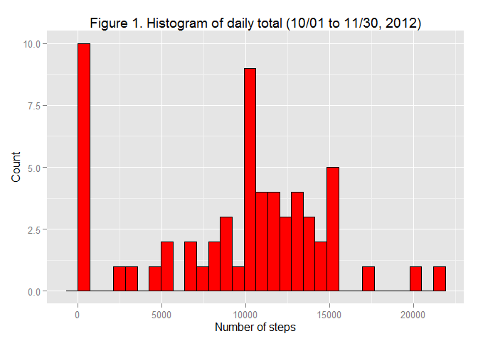
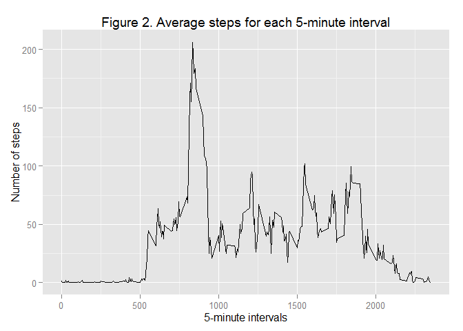
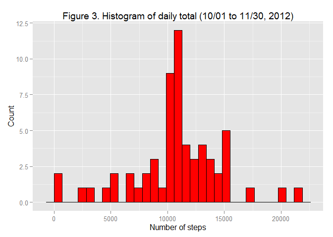
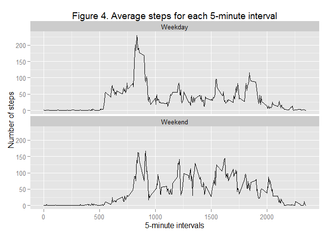

# Reproducible Research: Peer Assessment 1
lujienc  
November 8, 2015  

## Loading and preprocessing the data  


```r
library(dplyr)
```

```
## 
## Attaching package: 'dplyr'
## 
## The following objects are masked from 'package:stats':
## 
##     filter, lag
## 
## The following objects are masked from 'package:base':
## 
##     intersect, setdiff, setequal, union
```

```r
library(ggplot2)
options(scipen = 1, digits = 2)
setwd("D:/Data Science Certificate/Course 5_Reproducible Research/Projects/Project 1/RepData_PeerAssessment1")
activity <- read.csv(unz("activity.zip", "activity.csv"), header = TRUE)
activity$date <- as.Date(activity$date, "%Y-%m-%d")
str(activity)
```

```
## 'data.frame':	17568 obs. of  3 variables:
##  $ steps   : int  NA NA NA NA NA NA NA NA NA NA ...
##  $ date    : Date, format: "2012-10-01" "2012-10-01" ...
##  $ interval: int  0 5 10 15 20 25 30 35 40 45 ...
```

## What is central tendency of daily total steps?  


```r
## Calclate total steps per day
daily <- activity %>%
         group_by(date) %>%
         summarize(dtotal=sum(steps, na.rm=TRUE))
str(daily)
```

```
## Classes 'tbl_df', 'tbl' and 'data.frame':	61 obs. of  2 variables:
##  $ date  : Date, format: "2012-10-01" "2012-10-02" ...
##  $ dtotal: int  0 126 11352 12116 13294 15420 11015 0 12811 9900 ...
```

```r
## Plot a histogram of total steps per day
f1 <- ggplot(data = daily)
f1 + geom_histogram(aes(x=dtotal), fill = "red", col = "black") +
     ggtitle ("Figure 1. Histogram of daily total (10/01 to 11/30, 2012)") +
     labs(x = "Number of steps", y = "Count")
```

```
## stat_bin: binwidth defaulted to range/30. Use 'binwidth = x' to adjust this.
```

 

```r
## Mean and median of total steps per day
dtmean <- mean(daily$dtotal, na.rm=TRUE)
dtmedian <- quantile(daily$dtotal, probs = 0.5, na.rm = TRUE)
```
  
#### The mean of daily total steps is 9354.23.  
#### The median of daily total steps is 10395.  

## What is the average daily activity pattern?  


```r
## Calculate average steps across all days for each 5-minute interval
intavg <- activity %>%
           group_by(interval) %>%
           summarize(stepmean=mean(steps, na.rm = TRUE))
str(intavg)
```

```
## Classes 'tbl_df', 'tbl' and 'data.frame':	288 obs. of  2 variables:
##  $ interval: int  0 5 10 15 20 25 30 35 40 45 ...
##  $ stepmean: num  1.717 0.3396 0.1321 0.1509 0.0755 ...
```

```r
## Plot a time-series figure of interval average steps
f2 <- ggplot(data = intavg)
f2 + geom_line(aes(interval, stepmean), type = "1") +
     ggtitle ("Figure 2. Average steps for each 5-minute interval") +
     labs(x = "5-minute intervals", y = "Number of steps")
```

 

```r
## Identiy 5-minte intervals with the maxaum value of averaged steps
meanmax <- intavg %>%
           filter(stepmean==max(stepmean, na.rm = TRUE))
maxn <- meanmax[1,1]
maxv <- meanmax[1,2]
```
  
#### The 5-minute interval of 835 has the largest averaged steps of 206.17.  

## Imputing missing values  


```r
## Identify missing values
infmiss <- is.na(activity$steps)
tmiss <- sum(infmiss)
```
  
#### There are 2304 missing values in the dataset.      


```r
## Impute missing values using the mean of each 5-minute interval
actimpt <- activity %>%
           group_by(interval) %>%
           mutate(steps=ifelse(is.na(steps), mean(steps, na.rm=TRUE), steps))

## Calclate total steps per day
daily <- actimpt %>%
         group_by(date) %>%
         summarize(dtotal=sum(steps, na.rm=TRUE))
str(daily)
```

```
## Classes 'tbl_df', 'tbl' and 'data.frame':	61 obs. of  2 variables:
##  $ date  : Date, format: "2012-10-01" "2012-10-02" ...
##  $ dtotal: num  10766 126 11352 12116 13294 ...
```

```r
## Plot a histogram of total steps per day
f3 <- ggplot(data = daily)
f3 + geom_histogram(aes(dtotal), fill = "red", col = "black") +
     ggtitle ("Figure 3. Histogram of daily total (10/01 to 11/30, 2012)") +
     labs(x = "Number of steps", y = "Count")
```

```
## stat_bin: binwidth defaulted to range/30. Use 'binwidth = x' to adjust this.
```

 

```r
## Mean and median of total steps per day
dtmean <- mean(daily$dtotal, na.rm=TRUE)
dtmedian <- quantile(daily$dtotal, probs = 0.5, na.rm = TRUE)
```
  
#### The mean of daily total steps (with imputed missings) is 10766.19.  
#### The median of daily total steps (with imputed missings) is 10766.19.  
#### Clearly, as compared to the results reported in Figure 1, both mean and median of daily total steps have increased with missing values imputed based on the mean of each 5-minute interval across days. The daily total steps with imputed values (as illustrated in Figure 3) have a more symmetric distribution than that in Figure 1.

## Are there differences in average activity patterns between weekdays and weekends?  


```r
## Genreate an indicator of weekday vs. weekend
actimpt <- actimpt %>%
           mutate(temp=weekdays(date)) %>%
           mutate(weekd=ifelse(grepl("Sunday|Saturday", temp), "Weekend", "Weekday"))
 
## Calculate average steps across all days for each 5-minute interval for weekdays and weekends respectively
intavg <- actimpt %>%
          group_by(weekd, interval) %>%
          summarize(stepmean=mean(steps, na.rm = TRUE))
str(intavg)
```

```
## Classes 'grouped_df', 'tbl_df', 'tbl' and 'data.frame':	576 obs. of  3 variables:
##  $ weekd   : chr  "Weekday" "Weekday" "Weekday" "Weekday" ...
##  $ interval: int  0 5 10 15 20 25 30 35 40 45 ...
##  $ stepmean: num  2.251 0.445 0.173 0.198 0.099 ...
##  - attr(*, "vars")=List of 1
##   ..$ : symbol weekd
##  - attr(*, "drop")= logi TRUE
```

```r
## Identity max 5-minute interval average for weekdays and weekends 
temp <- intavg %>% group_by(weekd) %>% filter(stepmean==max(stepmean, na.rm=TRUE))
temp
```

```
## Source: local data frame [2 x 3]
## Groups: weekd [2]
## 
##     weekd interval stepmean
##     (chr)    (int)    (dbl)
## 1 Weekday      835      230
## 2 Weekend      915      167
```

```r
## Plot a time-series figure of interval average steps
f4 <- ggplot(data = intavg)
f4 + facet_wrap(~weekd, ncol = 1) +
     geom_line(aes(interval, stepmean), type = "1") +
     ggtitle ("Figure 4. Average steps for each 5-minute interval") +
     labs(x = "5-minute intervals", y = "Number of steps")
```

 
  
#### As displayed in Figure 4, average 5-minute interval steps follow a more uniform distrubtion in weekends than in weekdays. In weekdays, average 5-minute interval steps peak around 8:35am with 230 steps. In weekends, average 5-minute interval steps peak around 9:15am with 167 steps. On average, people are way more active in the early morning (i.e., before 9am) during weekdays; however, they are more active in the afternoon and eary evening (i.e., between 12pm and 8pm) during weekends.
